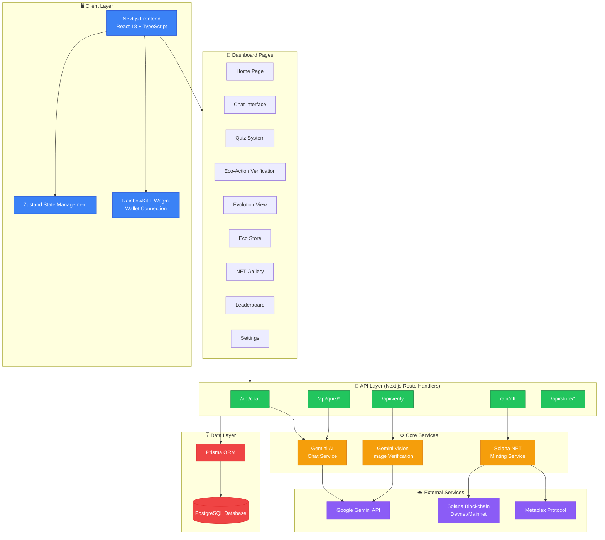
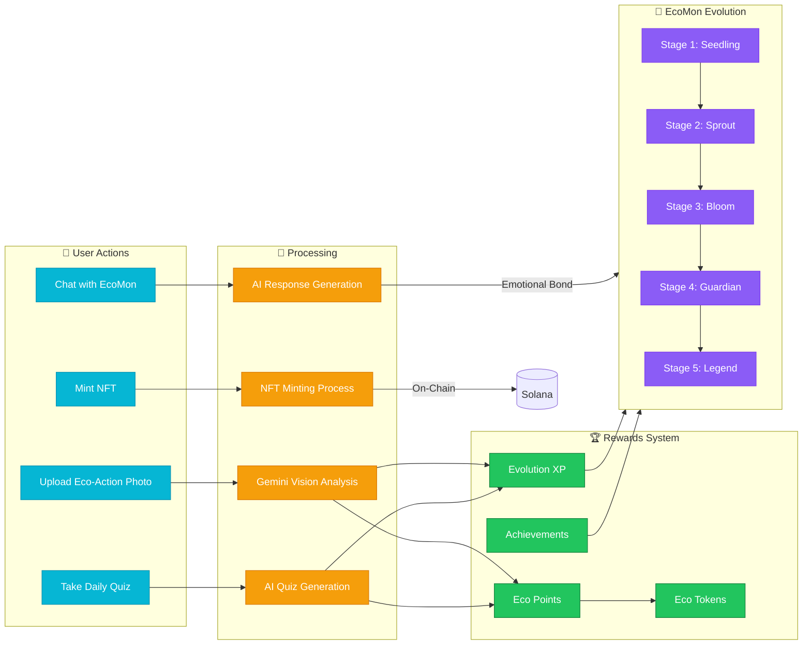
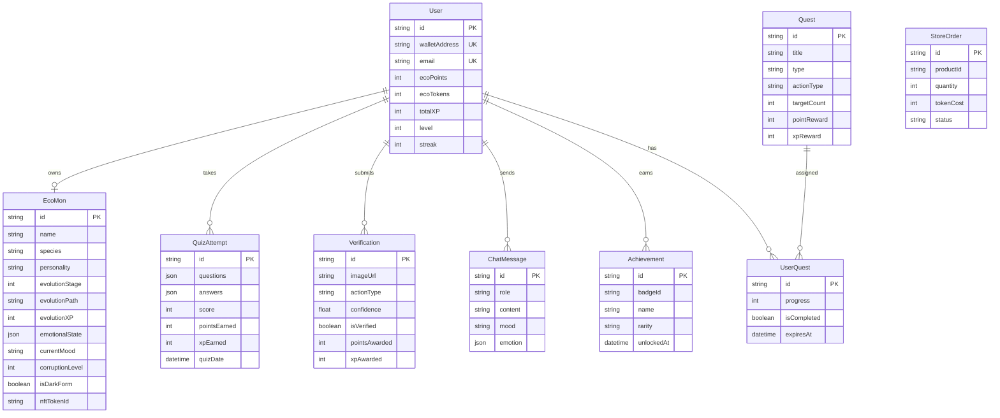
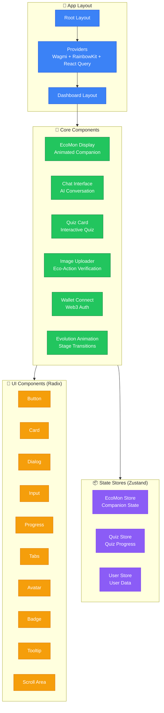
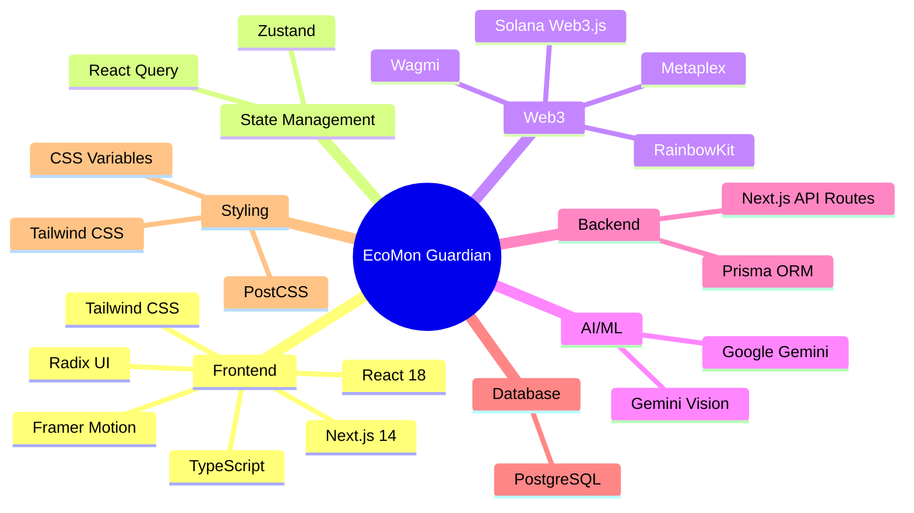
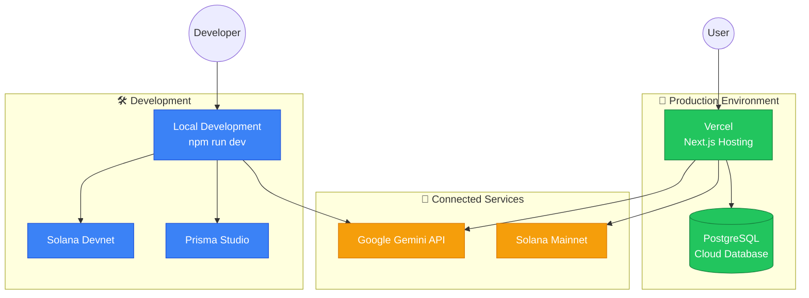

# EcoMon Guardian - Architecture Diagram

## System Architecture

## Data Flow Architecture

## Database Entity Relationship

## Component Architecture

## Technology Stack

## Deployment Architecture

## Key Features Summary

| Feature | Technology | Description |
|---------|------------|-------------|
| 🤖 AI Companion | Google Gemini | Personalized EcoMon with emotional intelligence |
| 📸 Action Verification | Gemini Vision | AI-powered eco-action photo verification |
| 🧠 Quiz System | Gemini AI | Dynamic environmental quiz generation |
| 💬 Chat Interface | Gemini AI | Context-aware conversations with EcoMon |
| 🎮 Evolution System | Custom Logic | 5-stage evolution based on eco-actions |
| 🎨 NFT Minting | Solana + Metaplex | On-chain NFTs for evolved EcoMons |
| 💳 Wallet Integration | RainbowKit + Wagmi | Multi-wallet Web3 authentication |
| 🏆 Achievement System | PostgreSQL | Badges and achievements tracking |
| 🛒 Eco Store | Custom | Token-based rewards marketplace |
